 
## 查看主页获取源码

### 一、作品包含

源码+数据库+设计文档万字+PPT+全套环境和工具资源+部署教程

### 二、项目技术

前端技术：Html、Css、Js、Vue、Element-ui

数据库：MySQL

后端技术：Java、Spring Boot、MyBatis

  

### 三、运行环境

开发工具：IDEA/eclipse

数据库：MySQL5.7

数据库管理工具：Navicat10以上版本

环境配置软件： JDK1.8+Maven3.6.3

前端Nodejs：14

### 四、项目介绍
项目编号：springbootA270

在贫困地区，许多儿童由于经济条件限制而无法获得必要的生活支持和教育资源，这限制了他们的成长和发展。为了帮助这些孩子打破困境，贫困地区儿童资助系统的建立显得尤为重要。该系统旨在通过信息化手段，有效地汇集社会爱心资源，精准地对接贫困儿童的实际需求，从而为他们提供稳定的资助，保障其基本生活和学习权利。

前台用户功能：浏览首页、贫困儿童、捐款发布、政策新闻、后台管理、个人中心。

后台分为管理员和用户
管理员的功能：系统首页、个人中心、用户管理、贫困儿童管理、爱心捐钱管理、爱心捐物管理、捐款发布管理、系统管理。
用户的功能：系统首页、个人中心、爱心捐钱管理、爱心捐物管理。

### 五、运行截图

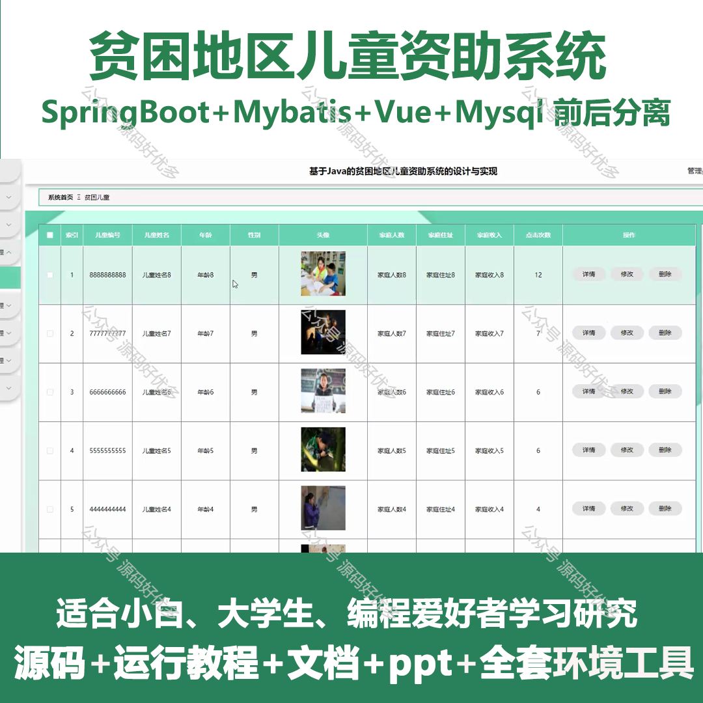
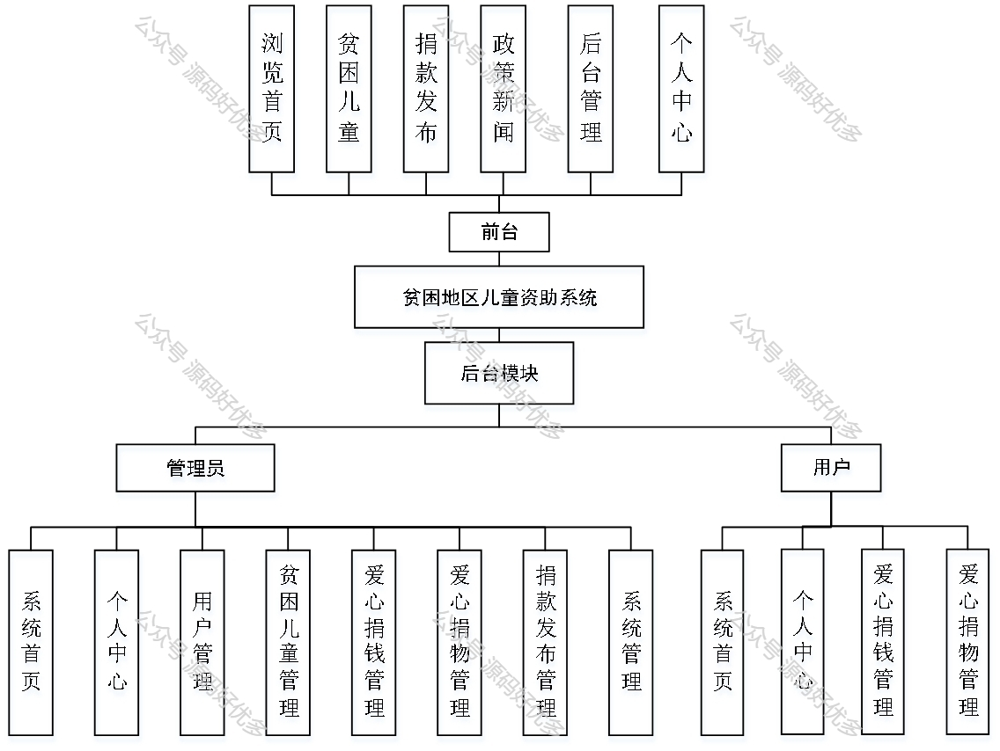
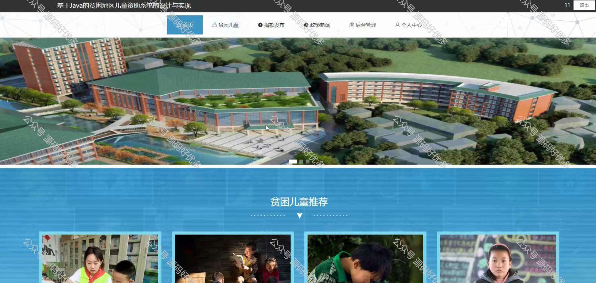
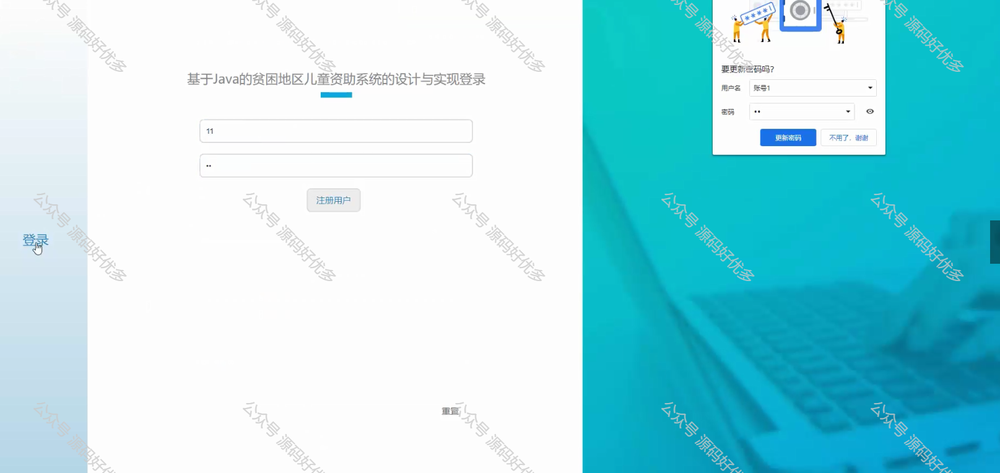
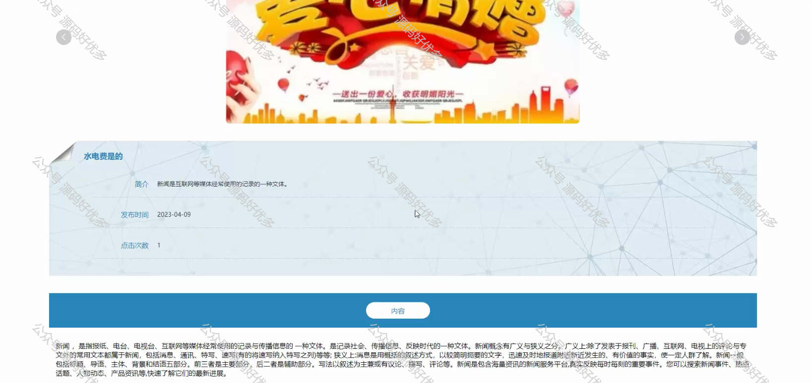
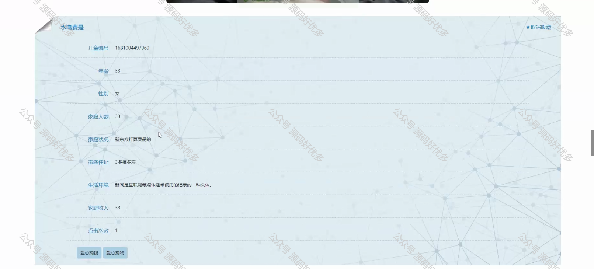
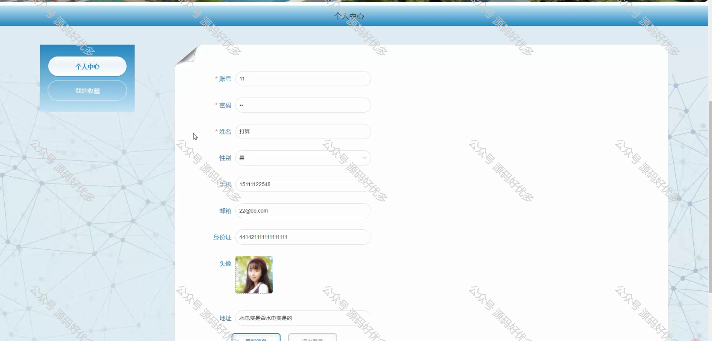
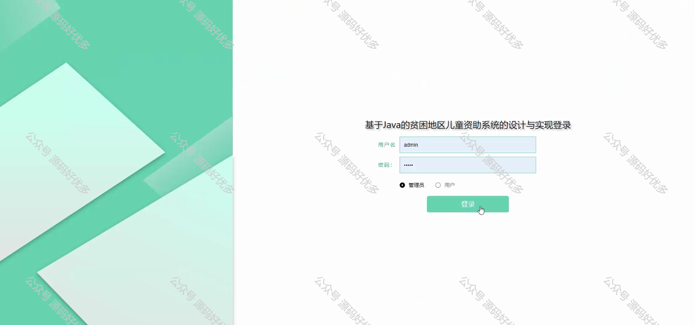
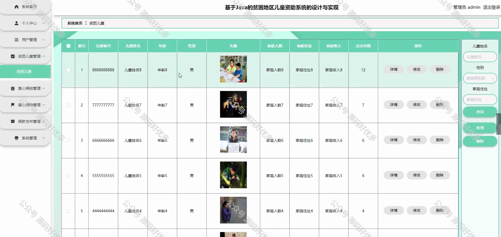
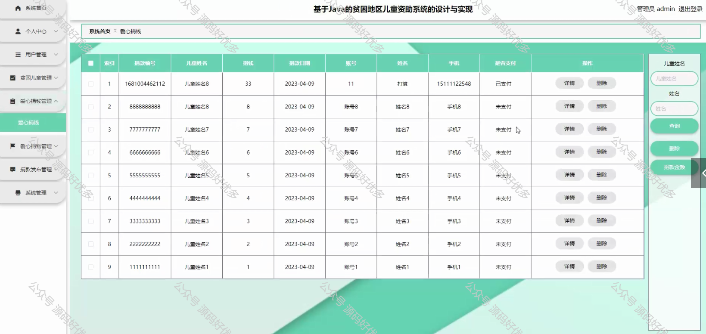
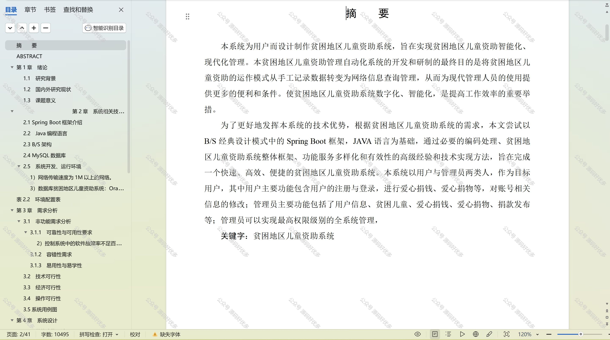

  
